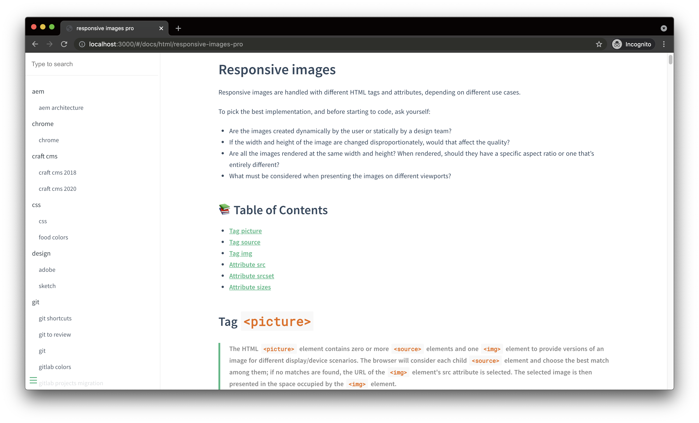

# Super notes

Personal tech notes, not always well organized 😇

| \                | \                                                                                                                                                                             |
|------------------|-------------------------------------------------------------------------------------------------------------------------------------------------------------------------------|
| Pipeline         | [](https://app.netlify.com/sites/super-notes-giuliachiola/deploys) |
| Deploy preview   | https://super-notes-giuliachiola.netlify.app/#/                                                                                                                               |
| Project typology | Personal                                                                                                                                                                      |



## 🔥 Tech stack

| Purpose            | Technology                                       |
|:-------------------|:-------------------------------------------------|
| Code snippets      | JS                                               |
| Documentation      | Markdown                                         |
| Presentation layer | [Docsify](https://github.com/docsifyjs/docsify/) |

## 🌊 Run development mode

```shell
# install dependencies
npm i

# serve with hot reload at localhost:3000
npm run dev
```

## 🧳 Build setup

```shell
# build for production
npm run build
```

## 📚 Project documentation

- [Generate automatic sidebar](docs/generate-automatic-sidebar.md)

### 🌿 Branches

| Branch name | Use        |
|:------------|:-----------|
| `main`      | production |
