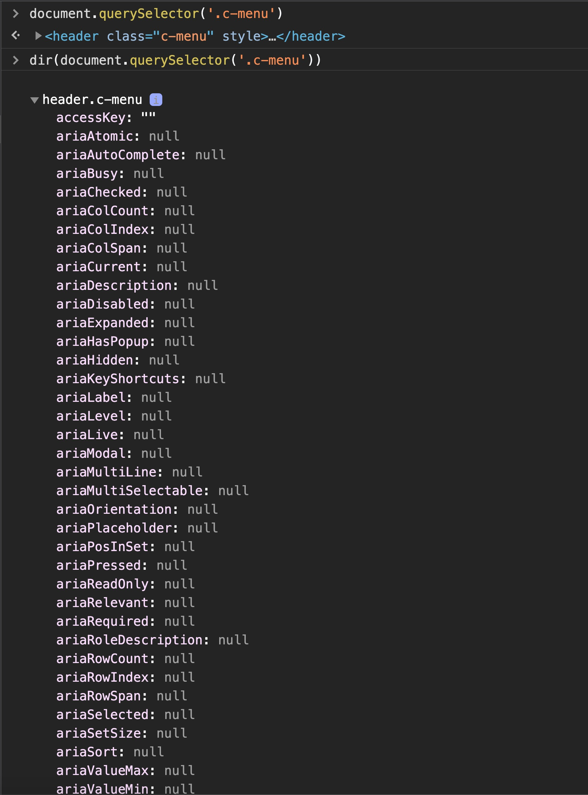

# Javascript - ES6

<span style="display: inline-block; background: #FCFFA6; padding: 4px 16px; border-radius: 4px; color: #484848"> ⚠️ Page not updated recently</span>

#### async/await

- async/await is syntactical sugar on top of generator functions which yield Promises.
- async and await, which make it much easier to write a series (take a mental note of that word, 'series') of asynchronous operations.

#### querySelector

```
let radice = document.querySelector('.c-modal')
radice.querySelector('.c-modal-content')
```

radice = radice da cui parto per vedere se l'altro nodo è qua dentro

#### closure

```js
function jump() {
  var height = 10;

  function scream() {
    console.log(height);
  }

  return scream;
}

var newJump = jump(); // function runs but doesnt log anything

// you would think that now our code has run
// you would think that javascript has gotten rid of our height variable

// but we can still use the newJump function as if our content was still intact
newJump(); // logs 10
```

Notice how we save the output of a function to a new variable. The jump function ran and processed itself and we saved the contents to a new variable. Should the height variable exist still after the function already ran?

What JavaScript does is keep a reference to that original scope and we are still able to use it and the height variable. This reference is called closure.

Currying is simply a way of constructing functions that allow for the partial application of a function’s arguments. In other words, a function that takes another function with multiple parameters and returns a function with fewer parameters.

#### Altro

- Array methods can be grouped into mutator methods, accessor methods and iteration methods

  - Mutator methods are those methods that actually alter or modifies the array, for example, the array.push()
  - Accessor methods are those that do not alter the array but rather create an image of the array based on the effect of the method, for example array.slice()
  - Iteration methods as the name implies are used to iterate over an array while sampling the length of the array and evaluating each element of the array with a callback function as defined in the method. This includes .forEach() and .map() methods.

- Array è un tipo di oggetto
  const a = [];
  typeof a; // returns object

### Creare un array di elementi

```js
randTags() => Array(*numberofitems* - 1).fill(0).map(tag => getRandTagItem())]
```

- `Array(N)` → crea una struttura di N elementi (buchi) vuoti
- `fill(0)` → riempie l'array di elementi "0" (potrebbe essere qualsiasi cosa) es. `fill('pippo')`
- `.map` adesso può applicare la funzione a quegli elementi (se non ci sono gli elementi creati con fill non posso applicare la funzione!)
- quando ho fatto `Array()` la struttura è vuota

## Override dentro il map della proprietà di un oggetto

```js
// return implicito (nota le parentesi tonde!!)

card: randCard().arrayFlags.map(cardFlagObj => ({
    ...cardFlagObj,
    hasImg: false
  })
),

// return esplicito

card: randCard().arrayFlags.map(cardFlagObj => {
  cardFlagObj.hasImg = false
  return cardFlagObj
})
```

## arrow functions

```js
// formalismo
[].map(callback)

// external function
const callback = function (el, index, array) {
  return something;
}

// external arrow function
const callback = (el, index, array) => something;

// inline, function()
[].map(function(el, index, array) {
  return something
})

// inline, arrow function
[].map((el, index, array) => something)

// example
[].map(Math.floor)
```

## Reduce vs map

- reduce → entra un array di N elementi, escono M elementi (numero diverso, solitamente utilizzato per buttarne fuori solo uno esempio somma)
- map → entra un array di N elementi, esce un array di N elementi

```js
const archiveList = Array(5)
  .fill("2019")
  .reduce((archive, year, idx) => {
    return [
      ...archive,
      ...months.map((m, index) => ({
        ...m,
        datetime: `${year - idx}-${String(index + 1).padStart(2, "0")}`,
      })),
    ];
  }, []);
```

## Lodash merge

come primo elemento ci va un oggetto vuoto perché copia da 3 -> dentro 2 -> dentro 1

```js
context: _.merge(
  {},  // 1
  templateContext, // 2
  {
    OVERRIDES HERE!! // 3
  }
)
```

## Property sintax

<!-- TODO: blog -->

Queste due sintassi sono uguali
`document.documentElement.scrollTop`
=
`document.documentElement["scrollTop"]`

## DOM node and its properties

`document.querySelector('.c-menu')` → restituisce il nodo
`dir(document.querySelector('.c-menu'))` → restituisce le proprietà del nodo



[https://developer.mozilla.org/en-US/docs/Web/API/Console/dir](https://developer.mozilla.org/en-US/docs/Web/API/Console/dir)

references:

- [https://www.youtube.com/watch?v=7UstS0hsHgI&ab_channel=Avelx&t=2s](https://www.youtube.com/watch?v=7UstS0hsHgI&ab_channel=Avelx&t=2s)
- [https://www.youtube.com/watch?v=jqU3uaRgQyQ&ab_channel=DaniKrossing](https://www.youtube.com/watch?v=jqU3uaRgQyQ&ab_channel=DaniKrossing)

## Proxy

proxy: alcune funzioni come il `sort()` invocano il `console.log()` tante volte quante le celle dell'array [vedi blog](https://codeburst.io/understanding-javascript-proxies-by-examining-on-change-library-f252eddf76c2)

## Events

passive: true → non chiamerà mai preventDefault() evento passivo che non interferisce con gli altri eventi del browser (più efficiente)

document.querySelector('.c-menu') → chiede al DOM tutti i nodi del dom fino ad arrivare a c-menu
mentre `this.$refs('cMenu')` → così invece è nell'elenco dei refs di Vue già disponibile (non deve chiedere al DOM di darglielo, e risparmio una chiamata al DOM)

### Event listeners

- posso avere 2 event listener con metodi diversi

```sass
document.addEventListener('click', method1)
document.addEventListener('click', method2)

document.removeEventListener('click', method1)
```

## Primitive

> In JavaScript, a **primitive** is data that is not an object and has no methods. There are 7 primitive data types: string, number, bigint, boolean, undefined, symbol, and null.
>
> All primitives are immutable.

[MDN primitive](https://developer.mozilla.org/en-US/docs/Glossary/Primitive)

## Date

```js
Date(); // returns a string
new Date(); // returns a Date object
```

# `+` symbol

The `+` operator returns the numeric representation of the object.

```js
const a = "10";
const b = +a;

console.log(b); // 10
console.log(typeof b); // number
```
